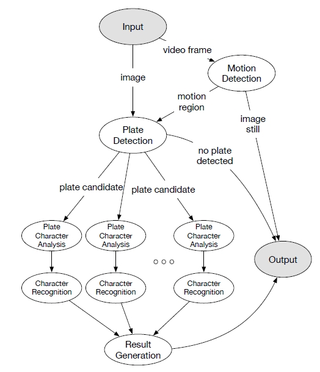

#### Poster Abstract: Continuous Computing from Cloud to Edge

- Continuous computing
  - support the mobility of workloads across compute domains from cloud to edge
- workload mobility
  - we assume modular applications that are composed from self-contained components, so called workloads
  - workloads is the ability to move application components with and across compute domains

#### MVR: an Architecture for Computing Offloading in Mobile Edge Computing

> The ability of computation offloading, which is one of the main features of MEC gains relevance as a technique to improve the battery lifetime of mobile devices and increase the performance of applications

- this paper describes the offloading system model and present and innovate architecture for computation offloading under the MEC

#### LAVEA: Latency-aware Video Analytics on Edge Computing Platform

- cloudlet is an early implementation of the cloud-like edge computing platform with VM techniques
- 