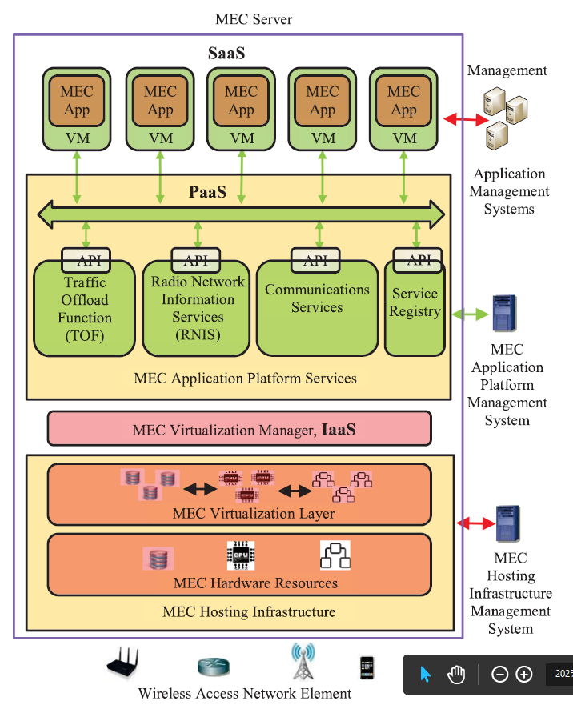

#### Mobile Edge Cloud System: Architectures, Challenges, and Approaches
##### MEC Characteristic and Applications

- Mobile Edge Cloud(MEC)的特征总结为“离得近，用的多，跑得快”

  - 离得近：MEC设备和终端设备距离近，从而可以容易获得本地信息(Local network status awareness, Local user context awareness)，以及极低的延迟(Ultra-low latency)
  - 用得多：MEC各个组成部分分布在不同的位置和层次上，具有分布式的特点(Distributed)，也导致了其具有Heterogeneity。
  - 跑得快：移动设备具有mobility，导致了MEC服务器的访问不可靠(unreliable access)

  除此之外，MEC还和传统的中央云是相辅相成的关系，而不是取代关系。

- MEC的应用：

  - 对应“离得近”：对于Latency-Sensitive的应用，MEC的极低延迟具有优势；离得近使得应用可以容易地获得本地网络状态，例如视频解码可以根据网络带宽调整video data rate，以及利用local context的应用。
  - 除此之外，对于需要处理和收集数据的应用，MEC的存在减轻了中央云的负担，例如带宽和存储。
  - *there maybe much higher bandwidth in wireless access network than on the cross-domain Internet links*，这句话该怎么理解？从实际应用出发，如何理解MEC可以降低带宽的需求？

- MEC和物联网边缘计算的概念并不重合，二者有交集，可以补上非移动物联网设备的边缘计算部分。

- MEC应用的分类，（交叉一下应当有6个类别，都有哪些例子）

  - 第一种，从应用需求出发分类
    - 传统应用
    - 物联网应用（主要驱动），其原因有三：1.高带宽需求的应用2.实时性要求高的应用3.物联网设备本身的局限性（这个更普遍）
  - 第二种，根据用户-MEC交互行为分类
    - 计算分流（例如VR，人脸识别）
    - 协作计算（例如车辆的追踪）
    - 网络内处理（降低互联网流量和存储需求）（这个算是传统应用？？）

##### MEC Services Models

- MEC和传统云计算有很大不同（还是围绕MEC的特征来比较，加了一点：MEC的计算能力要弱于中央云），但是它同样提供IaaS, PaaS, SaaS三种层次服务
- 重点不在于服务本身（除了透明服务的概念，与传统互联网服务没有太大差别），而在于部署、使用这些服务等一系列问题

##### MEC Server

- 这部分主要看架构图就可以了，（参考ESTI白皮书）
- *The MEC virtualization manager provides a multi-tenant environment. MEC applications from network operators and third parties can be deployed and run with VMs*, 这部分的作用怎么理解？它与基础设施管理接口(Infrastructure management interface)有什么关系？是否可以认为他们的作用是一样的？